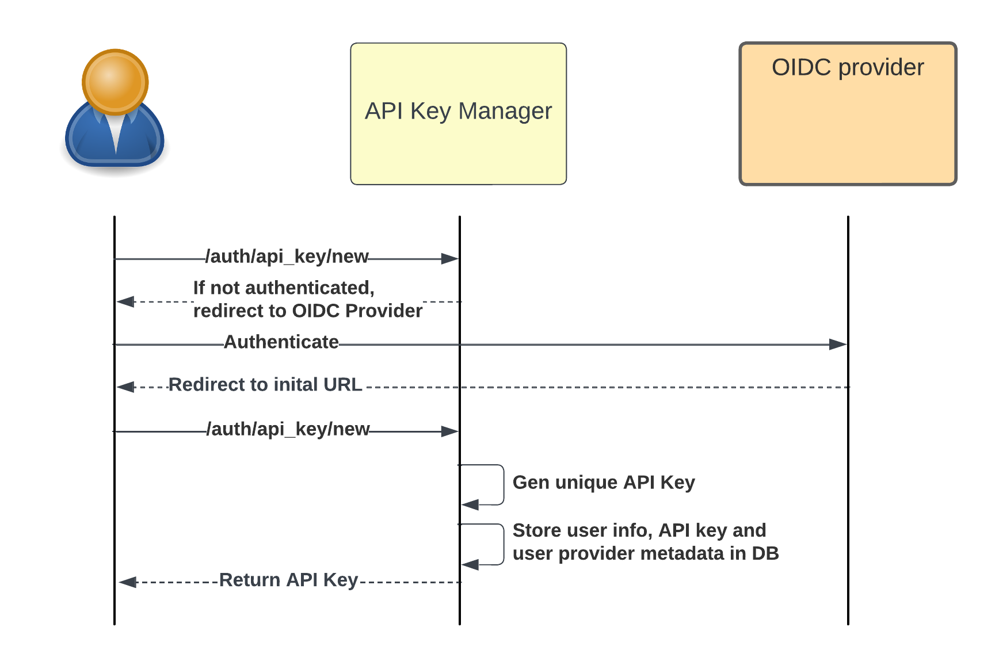

# API Key Manager

APIKeyManager is - as the name probably suggests - an API key manager. Developed as a Python service, it will generate and manage unique codes for identifying and authenticating users, applications or services accessing the APIs (Application Programming Interfaces) of underlying services protected in this way, and assigning rights to these services.

The aim of this service is to enable users to generate API keys that they can use with various off-the-shelf tools and libraries that do not support OIDC (like GDAL) while guaranteeing sufficient security and fine-grained management of API rights/capabilities.

Its functionalities can be compared to the token authentication offered by tools like Gitlab: a user uses the OIDC service to connect to GitLab and generate API keys. These can then be used directly, without the need for complex authentication mechanisms, with limited rights and on a specific set of projects.

The need for a simple authentication mecanisms (by header or via the query), is notably motivated by the direct exploitation of data with tools such as GDAL, RasterIO, QGIS, JupyterLab...
The use of Keycloak and JWT tokens has also been envisaged, but a user can only have a defined number of tokens for his or her services (only one per OIDC client), and this token is available only to a limited number of users.

## Main features

The APIKeyManager component offers the following functions:

- _API key generation_: allows new API keys to be created for developers or authenticated users from an OIDC session. An API key can have a validity date, rights to specific applications, a list of hosts from which the API key is valid, and a free section, allowing integrators to implement specific parameters in their applications.
- _Key revocation_: enables existing API keys to be revoked if necessary, for example in the event of compromise or change of access.
- _Monitoring and analysis_: APIKeyManager provides monitoring and analysis of key usage, via a counting mechanism (currently very simple).
- _SSO rights synchronization_: APIKeyManager enables you to retrieve the user's Keycloak rights, and synchronize them with the key's rights. If the user is deactivated in Keycloak, his API keys are automatically revoked after a given time, even if their expiry date has not been reached. Groups are also synchronized, to provide information to the underlying services if necessary.
- _Security_: Protection of key verification APIs against brute-force attacks, management of keys requiring OIDC authentication.

## Architecture


### Create API Key workflow



### Use API Key workflow


## Usage

### Quickstart

```bash
virtualenv -p python3.11 venv
source venv/bin/activate
pip install -e . --no-cache-dir
uvicorn app.main:app --host localhost --port 9999 --reload --log-config=log_config.yaml
```

### Env vars

| Variable                       | Description                                                        | Default                 |
| ------------------------------ | ------------------------------------------------------------------ | ----------------------- |
| APIKM_NAME                     | Application name                                                   | `"API-Key Manager"`     |
| APIKM_ROOT_PATH                | API root path                                                      | `""`                    |
| APIKM_DEBUG                    | DEBUG mode (display SQL queries)                                   | `False`                 |
| APIKM_CORS_ORIGINS_REGEX       | Allow CORS from (regexp)                                           | `""`                    |
| APIKM_CORS_ALLOW_METHODS       | Allow CORS for methods                                             | `"GET"`                 |
| APIKM_DATABASE_URL             | Database to store API Keys                                         | `"sqlite:///./test.db"` |
| APIKM_DEFAULT_APIKEY_TTL_HOUR  | Default lifetime of an API Key (in hour)                           | `360`                   |
| APIKM_OIDC_ENDPOINT            | OIDC End Point                                                     | `""`                    |
| APIKM_OIDC_REALM               | OIDC Realm                                                         | `""`                    |
| APIKM_OIDC_CLIENT_ID           | OIDC CLient ID                                                     | `""`                    |
| APIKM_OIDC_CLIENT_SECRET       | OIDC Secret used to sync user info from Keycloak                   | `""`                    |
| APIKM_RATE_LIMIT               | Rate limiter configuration for the check apikey endpoint           | `20/minute`             |
| APIKM_KEYCLOAK_SYNC_FREQ       | Sync frequency of a user with data stored in Keycloak (in seconds) | `300`                   |
| APIKM_SHOW_TECHNICAL_ENDPOINTS | Show technical endoints (health)                                   | `True`                  |

### Endpoints


## Developement

### Install development environment

Creating the development environment :

```bash
virtualenv -p python3.11 venv
source venv/bin/activate
```

setuptools allows you to install a package without copying any files to your interpreter directory (e.g. the site-packages directory). This allows you to modify your source code and have the changes take effect without you having to rebuild and reinstall. Here’s how to do it:

```bash
pip install -e .[dev] --no-cache-dir
```

To run precommit rules against all the files

```bash
pre-commit install # Enable precommit
pre-commit run --all-files
```

### Launch test

The execution of the tests is done with `pytest`. It is fully automated, thanks to the use of `pytest-docker` which will automatically start a `timescaledb` container to run the tests.
The launch of the tests is simply done with the following command :

```bash
python -m pytest
```

### Run with uvicorn

```bash
uvicorn app.main:app --host localhost --port 9999 --reload --log-config=log_config.yaml
```

You can check the API docs at [localhost:9999](http://localhost:9999/docs/).

### Run with docker container

Build image

```bash
docker build -t apikeymanager:latest .
```

Use it

```bash
docker run --name apikeymanager --rm \
    -e APIKM_OIDC_ENDPOINT='' \
    -e APIKM_OIDC_REALM='' \
    -e APIKM_OIDC_CLIENT_ID='' \
    -e APIKM_OIDC_CLIENT_SECRET='' \
    -p 9999:8000 \
    apikeymanager:latest
```

You can check the API docs at [localhost:8000](http://localhost:8000/docs).

### Publish the Docker image to the Image repository

```bash
docker image tag apikeymanager:latest 643vlk6z.gra7.container-registry.ovh.net/metis/apikeymanager:latest

docker push 643vlk6z.gra7.container-registry.ovh.net/metis/apikeymanager:latest
```

### HELM

Create a robot account in the harbor interface to access GeoJson Proxy Image

```bash
kubectl create namespace apikeymanager

kubectl create secret docker-registry regcred --docker-username='<LOGIN>' --docker-password='<PASSWORD>' --docker-server='643vlk6z.gra7.container-registry.ovh.net' --namespace apikeymanager
```

Deploy APIKey Manager

```bash
helm upgrade --install apikeymanager ./deploy/helm/apikeymanager --namespace apikeymanager --values deploy/helm/values.yaml
```

Remove APIKey Manager

```bash
helm delete apikeymanager --namespace apikeymanager
```

## Copyright and License

Copyright 2023-2024, CS GROUP France

_apikeymanager_ is a free and open source software, distributed under the
Apache License 2.0. See the `LICENSE.txt` file for more information, or the
quick summary of this license on Legal website.
